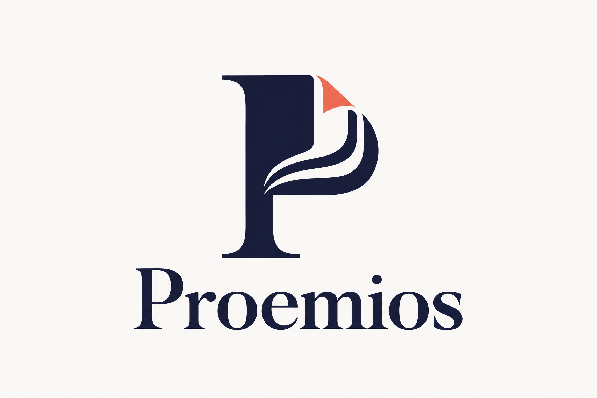
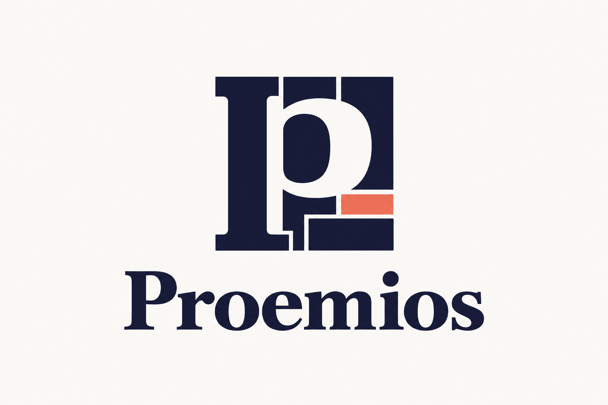
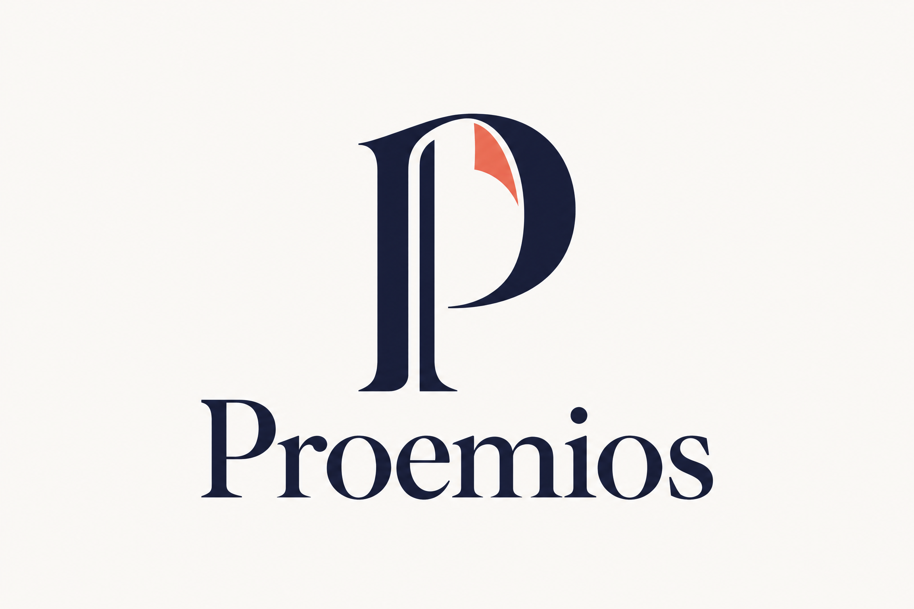
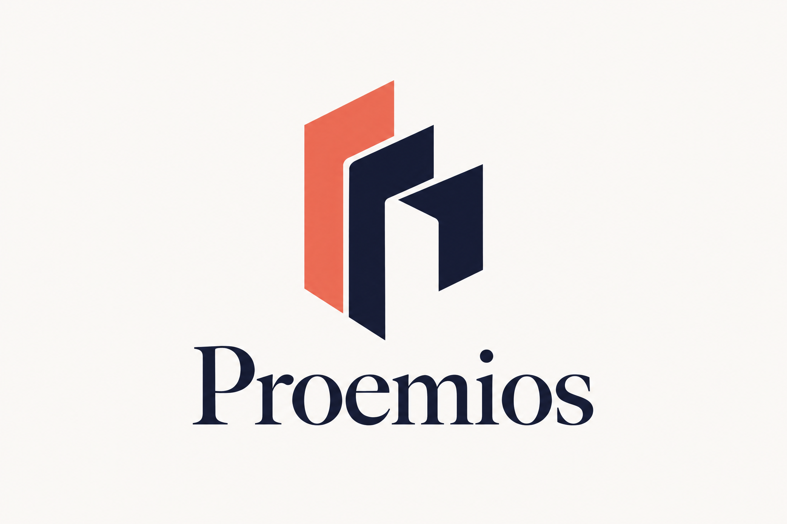
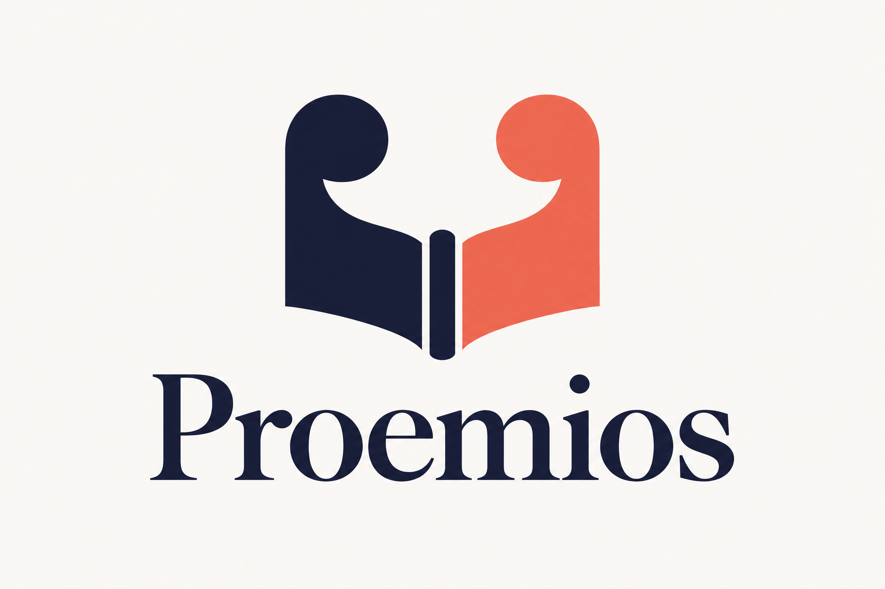

# Proemios — Cinque concept di logo e prompt di restyling

Questa cartella contiene **materiali di design esterni al sito**, preparati il 6 ottobre 2026. Nessun asset è collocato in `public`, importato dai componenti o usato come favicon. Il codice applicativo e il logo attuale non sono stati modificati.

## Prompt per il prossimo intervento

Il [prompt operativo completo](./PROMPT-MODIFICHE-PROEMIOS.md) traduce il feedback in modifiche implementabili: hero con libro cliccabile più evidente, animazione a tasselli, analisi facoltativa nel preventivo, cinque percorsi, dashboard anticipata e aggiornata, fiducia, header/footer, controlli funzionali e criteri di accettazione.

Il prompt è stato ancorato alla homepage renderizzata su [Vercel](https://proemios.vercel.app/) e al branch `claude/kalamos-studio-phase-1-6z6xyw`, commit `338d368`. La corrispondenza visiva non certifica il commit del deploy. È un brief per un intervento successivo: le modifiche descritte **non sono state applicate** in questa PR.

## Cinque proposte

La palette riprende il sito: blu inchiostro, corallo e avorio. Ogni PNG è una proposta autonoma da 2304×1536 px, con simbolo e scritta Proemios. Le immagini sono concept raster generati con IA, non esecutivi vettoriali o font definitivi.

| Proposta | Idea | Carattere |
| --- | --- | --- |
| 01 — Pagina iniziale | La P si apre in una sequenza di pagine, con un angolo corallo. | Letterario, immediato, vicino all’identità attuale ma più esplicito. |
| 02 — Carattere mobile | Una p in negativo entro una composizione di elementi tipografici. | Forte, compatto, distintamente tipografico. |
| 03 — Segno di paragrafo | Una P con doppio tratto verticale e una pagina interna curva. | Elegante, più sottile e vicino al linguaggio dei segni editoriali. |
| 04 — Fascicolo | Tre forme piegate e sovrapposte richiamano i fascicoli di un libro. | Architettonico, originale, meno letterale. |
| 05 — Voce e pagina | Le virgolette si trasformano nelle due pagine di un volume. | Narrativo, accogliente, adatto a storie e competenze. |

**Direzioni consigliate:** la 02 se si vuole enfatizzare la tipografia; la 04 se si cerca il segno meno prevedibile e più vicino alla costruzione materiale del libro. La 01 è la soluzione più immediatamente riconoscibile come evoluzione del monogramma esistente.

### 01 — Pagina iniziale

### 02 — Carattere mobile

### 03 — Segno di paragrafo

### 04 — Fascicolo

### 05 — Voce e pagina

## Prima dell’adozione di un logo

Dopo una scelta, il concept andrà rifinito in vettoriale, con tipografia definitiva e varianti orizzontale, monocromatica, inversa e favicon. Saranno necessarie prove di leggibilità alle dimensioni reali e un controllo di disponibilità e somiglianza del marchio prima dell’uso commerciale. Queste verifiche non fanno parte dei concept consegnati.

## Verifiche di questa PR

Controllo visivo delle cinque immagini, corretta scrittura del nome, integrità dei file, collegamenti locali della documentazione e `git diff --check`. Non sono stati eseguiti build o test applicativi perché questa PR cambia esclusivamente documentazione e PNG esterni al runtime. I test riportati nel prompt sono requisiti per la futura implementazione, non risultati già ottenuti.
