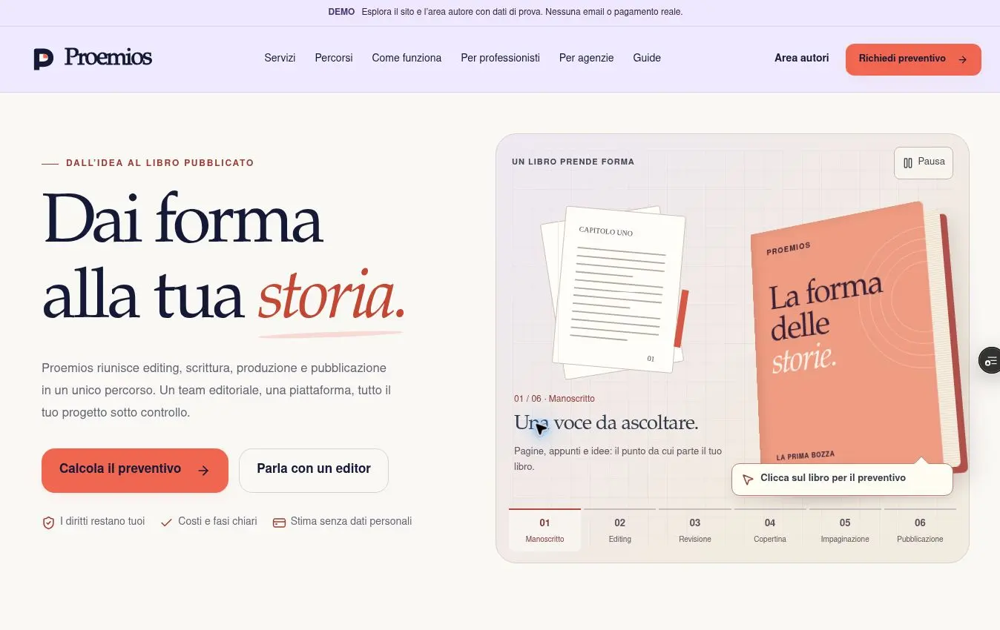

# Proemios — intervento e verifica, 6 ottobre 2026

## Base e consegna

La base pubblica verificata è `16fe6960d8871b10141f251cfc9c55a2305b43a5`, sul branch `claude/kalamos-studio-phase-1-6z6xyw`. È più recente del commit `338d368` citato nel prompt: conteneva già cinque percorsi, le sette voci condivise della dashboard, header lavanda, footer scuro e piattaforma prima del processo. Questi elementi sono stati conservati e affinati, senza tornare alla versione precedente.

Branch della proposta: `codex/proemios-prompt-completo`. Nessun merge, promozione Vercel o deploy di produzione è stato eseguito. Il collegamento GitHub/Vercel ha generato soltanto preview del branch. Il deploy di produzione osservato alla fine resta `dpl_BggfbrrP5T38GdTsBCF7kg5bUYao`, commit `16fe6960…`.

Logo, favicon, immagini social, `lib/pricing.ts` e `config/pricing.ts` non sono stati modificati. Nessuna migrazione, credenziale, transazione o manoscritto reale è stato usato.

## Risultato nel codice

- Hero avorio/lavanda, libro corallo più grande, cue sempre visibile e leggibile. Risolto il livello 3D che copriva l’etichetta. Libro e CTA aprono un solo assistente; la chiusura conserva le risposte e restituisce il focus al controllo usato.
- Sei composizioni editoriali distinte: pagine, annotazioni, revisione approvata, proposte di copertina, gabbia, volume finale. Sedici tasselli decorativi, transizione massima di circa 780 ms, permanenza di 6 secondi, un solo ciclo. Scelta manuale, pausa, replay e sospensione per focus, puntatore, dialog, viewport e scheda. Reduced motion senza autoplay/tilt; dissolvenza semplice su mobile.
- Analisi facoltativa dopo la dimensione. Idee/materiali e sola grafica saltano l’upload in entrambe le direzioni. Si riusano `FlussoAnalisi` e `/api/analisi`; il report può ritornare al brief. Il conteggio del file modifica la lunghezza del progetto solo con una scelta esplicita.
- Stima anonima distinta dalla registrazione del preventivo e dal report con contatti. Materiali, tempi, servizi e contesto impresa passano al configuratore senza un secondo motore prezzi.
- Cinque card con testi richiesti e oggetti editoriali distinti, griglia 3+2 e una colonna mobile. Rimossa la vecchia regola che reintroduceva un carosello. Aggiunti i materiali di partenza alla pagina reale `/percorsi/storia-impresa`; mappatura al tipo supportato `libro-professionale` con contesto nel brief.
- Dashboard dimostrativa con navigazione condivisa, revisione e attività recente. Pagamenti: «Pagamento simulato: nessun addebito». Ingresso pubblico demo senza credenziali fittizie; errore esplicito quando l’archiviazione non funziona. Non è autenticazione cliente.
- Focus dei dialog e del menu mobile autore, download con revoca differita dell’URL, target principali e consensi più ampi. Rimossi stili della vecchia narrazione e la vecchia sfocatura applicata agli oggetti delle card.
- Informazioni pre-upload e privacy allineate a estratto, metriche, memoria demo e scadenza dei record. Nessuna promessa di cancellazione automatica, lettura umana integrale, deposito copyright o esclusione dall’addestramento.

## Controlli eseguiti

| Controllo | Risultato reale |
| --- | --- |
| `npm ci` | PASS dopo aggiornamento del lockfile |
| `npm run typecheck` | PASS |
| `npm run test` | PASS: 73 test, 7 file; vedere [tests.log](tests.log) |
| `npx eslint .` | PASS; `next lint` non è stato usato |
| `npm run build` | PASS: 68 pagine generate; vedere [build.log](build.log) |
| `git diff --check` | PASS |
| `node tests/fixtures/http-smoke.mjs` | PASS: 32 GET e 6 POST; vedere [http-smoke.json](http-smoke.json) |

Lo smoke HTTP avvia Next con `DEMO_MODE=on` e senza variabili delle integrazioni operative. Verifica le destinazioni pubbliche estratte da home, servizi, percorsi e guide, la pagina impresa, contatti, agenzie, preventivo e tre richieste non valide. HTTP 200 dell’area autore verifica soltanto la risposta del server, non l’ingresso nella sessione browser. La sitemap demo è esclusa dall’indicizzazione; il codice della sitemap legge già l’elenco condiviso dei percorsi.

I nuovi test coprono gli ingressi condivisi e il focus dell’assistente, passaggio del brief/prezzi/materiali, salto dell’upload, ritorno dal report, ciclo/selezione/replay, composizioni distinte, cinque percorsi, sette sezioni, errori upload/API, reduced motion e azioni demo autore. La verifica reduced motion automatizzata usa `matchMedia` simulato in JSDOM, non l’emulazione di un browser reale.

### Browser, dati esclusivamente sintetici

Verificati sulla preview `60a35e004b812616abe9a2b781c15a59feb33b0f`:

- Assistente dalla CTA; completamento delle domande; Escape e ritorno del focus; riapertura dal libro con Enter e risposte preservate; Tab contenuto nel dialog; passaggio al configuratore con materiale e servizi.
- Analisi di un TXT sintetico di 330 parole. Privacy separata e marketing non selezionato. Il report DEMO usa metriche reali; rientro ai servizi mantiene la lunghezza dichiarata di 50.000 parole e le scelte, senza applicare il conteggio dell’estratto.
- Contatto editor con dati `qa@example.test`: stato di invio e conferma «Invio simulato». Agenzia sintetica: consenso e invio da tastiera, conferma «Hai provato il percorso per le agenzie».
- Configuratore a 390 px: scelta Romanzo → Solo materiali → 50.000 parole → servizi, senza passaggio upload e senza sconfinamento.
- Scene selezionabili, cue mobile visibile, percorsi in colonna, dashboard con sette sezioni, focus del footer.

Misure della **homepage** a diverse larghezze dell’iframe, con breakpoint CSS reali e scrollbar verticale di 15 px:

| Larghezza viewport | Larghezza disponibile | Larghezza contenuto | Overflow orizzontale |
| ---: | ---: | ---: | --- |
| 360 | 345 | 345 | assente |
| 390 | 375 | 375 | assente |
| 768 | 753 | 753 | assente |
| 1280 | 1265 | 1265 | assente |
| 1440 | 1425 | 1425 | assente |

La fixture riproducibile è [tests/fixtures/responsive.html](../../../tests/fixtures/responsive.html). È stata servita solo nelle preview di verifica; `public/qa-responsive.html` è stato rimosso dalla consegna finale.

### Verifiche non certificate e blocchi

1. **Ingresso/uscita dell’area autore nel browser**: il click e Enter sull’ingresso demo non hanno portato alla dashboard; una successiva navigazione all’area è tornata ad `/accedi`. Nessun errore applicativo utile è stato osservato. La causa non è stata attribuita né al codice né all’ambiente. Le azioni della workspace passano in JSDOM, ma questo non certifica ingresso, uscita, menu mobile e download effettivo nel browser. La PR resta una bozza per questo controllo aperto.
2. **Zoom reale al 200%**: cinque scorciatoie native Ctrl+Plus non hanno cambiato `innerWidth`, `devicePixelRatio` o scala del viewport. Non è un test al 200% passato. Nessuna API documentata di emulazione zoom/reduced motion era disponibile; va completata la verifica in un browser ordinario.
3. **Ultimo commit della preview**: la preview `a7033886…` è READY, ma il browser arriva alla pagina di accesso Vercel. Il controllo automatico ha rifiutato una lettura tramite `web_fetch_vercel_url` perché poteva creare un link temporaneo di accesso alla preview protetta. Non sono stati creati ulteriori link né allentata la protezione. Le ultime correzioni (oggetti senza sfocatura, target link, feedback storage, testi privacy e target consensi) passano i controlli locali; non sono dichiarate verificate visivamente sulla preview finale.
4. Dettatura/microfono, ciclo completo cronometrato nel browser, tutti gli errori di rete dei form, tutti i form a ogni larghezza e audit quantitativi di contrasto/prestazioni non sono certificati. Le verifiche elencate sopra non equivalgono a un audit completo WCAG o Lighthouse.

## Screenshot e provenienza

I «prima» provengono dalla produzione `16fe6960…`; i «dopo» dalla preview `60a35e00…`. Quest’ultima precede la rimozione della sfocatura delle card e i ritocchi finali dei target. Non usare quelle immagini come prova dell’ultimo commit. Le immagini mobile sono ritagli della sola area del sito dentro un iframe a 390 px; non sono mockup o screenshot generati. Nessun elemento del sito è stato modificato nei ritagli.

| Vista | Prima | Dopo verificato |
| --- | --- | --- |
| Intera homepage desktop, incluse sezioni, fascia dashboard e footer | [prima](before-desktop.webp) | [dopo](after-desktop.webp) |
| Hero desktop | nella homepage completa | [hero](after-desktop-hero.webp) |
| Header e CTA mobile | [prima](before-mobile-header.webp) | [dopo](after-mobile-header.webp) |
| Libro e cue mobile | [prima](before-mobile-hero.webp) | [dopo](after-mobile-hero.webp) |
| Percorsi mobile | [prima](before-mobile-paths.webp) | [dopo](after-mobile-paths.webp) |
| Fascia piattaforma mobile | [prima](before-mobile-platform.webp) | [dopo](after-mobile-platform.webp) |
| Dashboard in homepage mobile | [prima](before-mobile-dashboard.webp) | nella [fascia dopo](after-mobile-platform.webp) |
| Footer e focus mobile | [prima](before-mobile-footer.webp) | [dopo](after-mobile-footer.webp) |
| Configuratore senza manoscritto mobile | — | [servizi dopo il salto upload](mobile-wizard-skip.webp) |

Non è disponibile un confronto browser prima/dopo della workspace autore effettiva, a causa del controllo ingresso aperto. L’anteprima in homepage è documentata separatamente e resta etichettata DEMO.

## Integrazioni e condizioni per il servizio reale

- Neon/database e autorizzazioni operative del team: codice presente, permessi reali, regione e disponibilità non certificati in questa consegna.
- Anthropic: metriche sull’intero testo estratto; fino alle prime 8.000 parole inviate per il giudizio automatico quando configurato. L’API è riusata; nessun manoscritto reale né chiamata pagata eseguita.
- Resend e recapiti configurati: nessuna email reale inviata; verificare mittente, caselle e ricezione, incluso il recapito privacy. La presenza di un indirizzo in configurazione non certifica che la casella sia operativa.
- Stripe/checkout/webhook: non verificati con un addebito reale. La homepage non usa una promessa Stripe non certificata; la demo dichiara nessun addebito.
- Analisi: produzione salva contatti, metadati, metriche e report, non il testo integrale nel database applicativo. Demo conserva record limitati nella memoria del processo. `expiresAt` esiste; non è stato trovato/verificato un processo di cancellazione automatica. La procedura disponibile è la richiesta al recapito privacy configurato, la cui gestione operativa va confermata.
- Area clienti reale, archivio documenti, ruoli, permessi e autenticazione restano un progetto distinto dalla simulazione con sessionStorage. `/admin` conserva la protezione esistente e non è stato convertito nell’area autore.
- Validazione legale necessaria: condizioni di diritti/licenze/riservatezza, conservazione effettiva, accessi e responsabili esterni, regioni/trasferimenti, gestione richieste di cancellazione e coerenza di termini/privacy/contratti. Nessuna di queste verifiche è sostituita dal restyling o dalla presenza di link legali.

