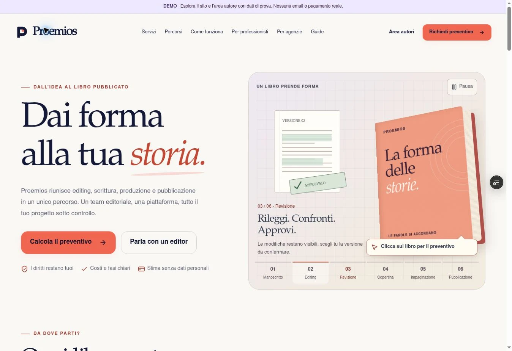

# Proemios — navigazione superiore, 7 ottobre 2026

Su richiesta dell’utente, la navigazione pubblica torna agli stili del commit `338d368`: fondo avorio `#faf8f5`, barra desktop alta 100 px, distanza di 23 px fra le voci e dimensioni precedenti del menu e del logo su mobile. Sono state rimosse le regole lavanda e l’ingrandimento 3D delle voci da `app/refinements.css`, incluse le relative regole responsive. Restano i target da almeno 44 px, il focus visibile, il menu e i collegamenti esistenti.

Commit applicativo verificato: `fd2b1d3d86c3b8c7eb2e1c20dca4cef488094396`. Deployment `dpl_GLybAquJivjEiwdX3mmxjV6n9HFp`, READY, target preview (`null`), sul branch `codex/proemios-prompt-completo`. URL canonico: https://proemios-hsyudfvv7-valerio-gestri-s-projects.vercel.app/ . Nessun merge o promozione in produzione.

## Verifica di questa modifica

- `npm run build`: PASS, 68 pagine; [log](build.log).
- `git diff --check`: PASS.
- Browser: homepage della preview aperta tramite il link temporaneo autorizzato. Sfondo del menu rilevato `rgb(250, 248, 245)`, altezza 100 px, gap 23 px, sei collegamenti nella navigazione desktop.
- Viewport desktop 1363 px: larghezza disponibile e contenuto entrambe 1348 px, senza overflow orizzontale.
- [Screenshot reale della home e della barra ripristinata](header-restored.webp), dalla preview del commit applicativo sopra. Il commit successivo aggiunge soltanto questa documentazione.

Non sono stati aggiunti test per una modifica di soli stili. Le verifiche precedenti (73 test e 38 richieste HTTP) restano documentate nel [rapporto del 6 ottobre](../proemios-20261006/README.md) e non sono presentate come nuove esecuzioni. Il mobile di questa versione non è stato certificato nel browser: le regole del menu ripristinate provengono dalla versione precedente.

## Stato dei controlli già aperti

Il blocco di accesso alla preview è superato: l’utente ha autorizzato i link temporanei e la nuova homepage è stata verificata. I token temporanei non sono salvati nel repository.

Sulla preview `39e5a419…`, il click sull’ingresso demo non ha mostrato la workspace né un errore di archiviazione. L’ingresso resta non certificato; la causa non è stata attribuita. Questo intervento non modifica l’area autore. Restano aperti lo zoom reale al 200% e gli altri controlli operativi elencati nel rapporto precedente. La PR resta in bozza.

